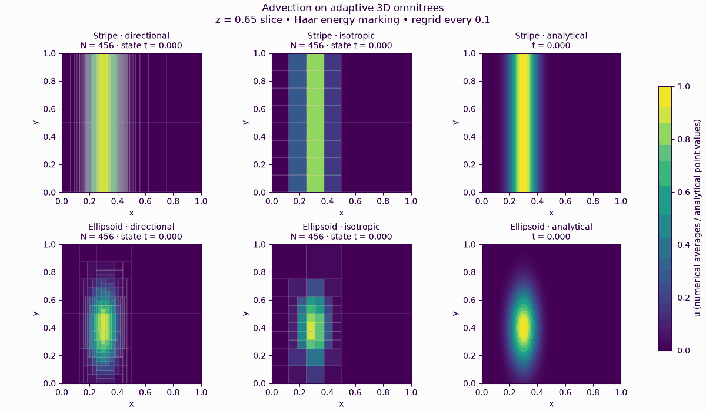

# omnitree-iterators

Exact geometric neighborhood iterators for **normalized [DyAda](https://github.com/freifrauvonbleifrei/DyAda) omnitrees**.
A project for building numerical stencils on anisotropically refined dyadic meshes.

The geometry API provides leaf iteration, shared face patches, boundary faces, per-cell face neighbors, point location, and rectangular region intersections.
It supports arbitrary dimension, hanging interfaces, and crossed tangential refinements without imposing mesh balancing.
Bounds and interface measures use exact rational arithmetic.

## Advection on adaptive omnitrees



A slice at **z = 0.65** through four 3D simulations: a translating stripe and an ellipsoidal Gaussian, each with directional or isotropic refinement and a budget of **456 rectangles**.
The right column shows the **analytical solution** on the same slice and color scale.
Numerical colors show cell averages; analytical colors show point values; lines show the mesh.
The runs continue to **t = 1.5**, with regridding every 0.1 time units.
The exact stripe center reaches x = 0.825 and the ellipsoid center x = 0.75.

The animation records actual solver states, holding each until its next numerical step.
Each panel displays its own state time: the methods use different global CFL time steps, while the analytical column follows the animation display time.
No extra steps are introduced to smooth the animation.
The first-order upwind solver is an experimental validation example, not a general PDE solver.

## Install

Python 3.10 or newer:

```bash
python3 -m venv .venv
source .venv/bin/activate
python -m pip install -e '.[test]'
python examples/crossed_faces.py
```

For development with an adjacent DyAda checkout:

```bash
python -m pip install -e ../DyAda
```

## Quick start

```python
from dyada.descriptor import RefinementDescriptor
from omnitree_iterators import Omnitree

mesh = Omnitree(RefinementDescriptor(2, [2, 1]))

# Every interior face patch appears once, including coarse/fine contacts.
for face in mesh.interfaces():
    print(face.minus.box_index, face.plus.box_index, face.axis, face.measure)

# Face neighbors on the positive x side of leaf 0.
for face in mesh.face_neighbors(0, axis=0, side=+1):
    print(face.plus.box_index, face.measure)

cell = mesh.locate((0.1, 0.2))
for hit in mesh.intersect((0, 0), (0.4, 0.6)):
    print(hit.cell.box_index, hit.bounds.measure)
```

| Operation | Result |
|---|---|
| `iter(mesh)` | Leaves in DyAda's Morton order |
| `interfaces()` | Interior face patches, oriented from minus to plus along the positive axis |
| `interfaces(include_boundary=True)` | Interior and domain-boundary patches |
| `boundary_faces()` | Boundary patches, with the exterior cell represented by `None` |
| `face_neighbors(box_index, axis, side)` | Interior contacts on one cell face; `side` is −1 or +1 |
| `locate(point)` | Containing leaf, or `None` outside the half-open unit domain |
| `intersect(lower, upper)` | Leaves and their positive-volume intersections with the query box |

A face's `measure` is its area (length in 2D), whereas `face.bounds.measure` is zero because the bounds have zero normal extent.
Edge-only and corner-only contacts are excluded.

## Mesh contract

Input must satisfy omnitree normalization: when all children split an axis, the parent must split that axis too.
Normalization does not imply balancing.
The constructor validates the descriptor and rejects unnormalized input.

```python
from dyada.refinement import normalize_discretization

normalized, mapping, _ = normalize_discretization(discretization, track_mapping="boxes")
mesh = Omnitree.from_discretization(normalized)
```

Use the returned old-to-new box mapping to reorder associated field data;
DyAda returns an empty mapping when normalization makes no changes.
`from_discretization` requires `MortonOrderLinearization`.

`Omnitree` is an indexed snapshot.
`box_index` identifies a leaf in the snapshot's data ordering; `descriptor_index` includes internal nodes.
Geometric keys `(level, index)` survive reorderings.
Queries use the unit hypercube and half-open cells, so coordinate 1 lies outside the domain.

See [geometry and implementation](docs/geometry.md) for exact coordinate semantics, traversal algorithms, and complexity limitations.
The package does not prescribe stencil weights, periodic topology, boundary conditions, or balancing.

## Numerical validation and results

The experimental solver assembles one conservative upwind flux per face patch and advances all rectangles with a common forward-Euler step constrained by outgoing fluxes.
Adaptive runs use directional Haar energy, limited conservative child prediction, a downstream safety region, and partial-axis coarsening through downsplitting.
Normalization mappings transfer the resulting leaf averages.
See [adaptation details](docs/adaptation.md).

| Experiment | Report |
|---|---|
| Fixed uniform, hanging, and crossed-interface meshes | [Advection validation](results/advection/README.md) |
| Extended advection to t = 1.5 | [Accuracy and runtime](results/haar-partial-long-advection/README.md) |
| Partial-axis Haar adaptation at t = 0.3 | [Accuracy and runtime](results/haar-partial-advection/README.md) · [Profile](results/haar-partial-profile/README.md) |
| Earlier whole-branch Haar adaptation | [Comparison with slab integration](results/haar-advection/README.md) |
| Original slab-integration adaptation | [Historical baseline](results/adaptive-advection/README.md) |

Errors are measured against the number of rectangles using the physical L² norm, including unresolved within-cell variation.
The examples show directional adaptation benefits; they do not establish asymptotic convergence orders.
Normalization dominates the measured directional ellipsoid runtime.
Historical reports identify the algorithm used; timing comparisons are single-run measurements.

Reproduce the current experiments without overwriting archived results:

```bash
python examples/adaptive_advection.py --output results/local-advection
python examples/profile_adaptive_advection.py \
  --reference results/local-advection/measurements.json --output results/local-profile
python examples/adaptive_advection.py --final-time 1.5 --output results/local-long-advection
python examples/animate_advection.py --final-time 1.5 --output docs/advection.gif
```

The GIF generator uses Matplotlib and Pillow and writes its numerical results alongside the animation as JSON.

## Tests

```bash
ruff check .
ruff format --check .
pytest --cov=omnitree_iterators
```

CI runs on Python 3.10, 3.12, and 3.14.
Tests cover independent geometric oracles, random normalized trees, crossed 3D interfaces, deep trees, conservation, positivity, Haar energies, partial-axis coarsening, and normalization mappings.

## Background

- [The Beauty of Anisotropic Mesh Refinement: Omnitrees for Efficient Dyadic Discretizations](https://arxiv.org/abs/2508.06316)
- [Towards Fully Dynamic Omnitrees: Moment-Conserving Anisotropic Compression With Wavelets](https://arxiv.org/abs/2607.04881)
- [Reference stack-based Haar transform and wavelet compression](https://github.com/freifrauvonbleifrei/wavelets_with_omnitrees)

Largely vibecoded -- use with caution.
